# ECMA-418-2:2025 fluctuation strength (Sottek Hearing Model): validation of the Python implementation

**Status: draft** (18 September 2026; updated same day following the quieter-period end-index bugfix)

This report summarises the performance of `shm_fluctuation_ecma()` (file `src/sottek_hearing_model/shm_fluctuation_ecma.py`, with the HSA subfunctions in `shm_subs.py`), a Python translation of the MATLAB implementation `acousticSHMFluctuation.m` in the [refmap-psychoacoustics](https://github.com/acoustics-code-salford/refmap-psychoacoustics) repository. Two questions are addressed:

1. **Translation fidelity**: does the Python code reproduce the MATLAB code it was translated from?
2. **Accuracy**: how well does the implementation agree with the reference implementation (HEAD acoustics ArtemiS SUITE v17)?

## 1. Test material

| Signal | Description | Reference files |
|---|---|---|
| `sine_1kHz_4Hz_60dB` | 1 kHz sinusoid, 100 % amplitude modulated at 4 Hz, 60 dB SPL (the standard's calibration signal), 10 s mono | overall, specific, time-dependent |
| `sine_1kHz_4Hz_2Hz_60dB` | 1 kHz sinusoid with a two-component (4 Hz + 2 Hz) modulation envelope, 60 dB SPL, 10 s mono | overall, specific, time-dependent |
| `BusyStreet1_0530-0600` | binaural recording of a busy city street (EigenScape database), 30 s stereo | L, R and binaural |
| `ExStereo_Park3-0002-0027_UAS` | binaural recording in a park with a drone (UAS) flyover, 25 s stereo | L, R and binaural |
| `TrainStation7-0100-0130` | binaural recording of a train station (EigenScape database), 29.9 s stereo | L, R and binaural |

The audio and reference files are those in `validation/ECMA-418-2/audio` and `validation/ECMA-418-2/reference` of the refmap-psychoacoustics repository (see the dataset at [doi:10.5281/zenodo.18849587](https://doi.org/10.5281/zenodo.18849587)). All signals are sampled at 48 kHz.

All Python results were computed with `soundfield='free_frontal'`, `binaural=True` and default settings. The MATLAB results were computed with `acousticSHMFluctuation.m` (refmap-psychoacoustics, 18 September 2026 version) in MATLAB R2026a.

## 2. Translation fidelity (Python versus MATLAB)

The time-dependent specific fluctuation strength F'(l50, z) and the overall time-dependent value F(l50) from the two implementations were compared directly.

| Signal | Channel | Max. abs. difference in F'(l50, z) | Relative Frobenius error in F'(l50, z) | Max. abs. difference in F(l50) | F (90th percentile) Python / MATLAB |
|---|---|---|---|---|---|
| `sine_1kHz_4Hz_60dB` | mono | 2.4e-9 | 3.5e-9 | 1.3e-9 | 0.99369 / 0.99369 |
| `sine_1kHz_4Hz_2Hz_60dB` | mono | 1.8e-9 | 3.8e-9 | 1.7e-9 | 0.61093 / 0.61094 |
| `BusyStreet1_0530-0600` | L / R | 2.2e-5 / 4.5e-8 | 6.5e-5 / 1.1e-7 | 2.5e-5 | 0.1537 / 0.1538 ; 0.1416 / 0.1416 |
| `ExStereo_Park3-0002-0027_UAS` | L / R | 5.9e-9 / 4.1e-3 | 7.4e-9 / 3.0e-3 | 7.5e-4 | 0.7709 / 0.7714 ; 0.5426 / 0.5426 |
| `TrainStation7-0100-0130` | L / R | 1.5e-4 / 2.6e-8 | 1.9e-4 / 1.3e-7 | 4.6e-5 | 0.2544 / 0.2544 ; 0.2145 / 0.2146 |

For the synthetic signals, and for one channel of each recording, the two implementations agree to floating-point precision (differences of order 1e-9, dominated by the different linear-algebra and FFT libraries). For the other channel of each recording, a small difference appears within a bounded time window, which was traced to a single analysis block/band for the Park recording and to a handful of blocks for the TrainStation recording (Section 5). For the Park recording (right channel, block 44, band 14 at 15.0 s) the cause was isolated by exporting the Python envelope spectrum of that block and running the MATLAB candidate-selection code (`findpeaks`, `shmHSA.m`, fine tuning and harmonic analysis) on the identical spectrum: MATLAB then reproduces the Python result exactly (one harmonic retained, order 1). In the full MATLAB run, however, the envelope power spectrum value at DFT bin 30 of that block lies within 2.1e-8 (1.4e-7 relative) of the Equation 143 threshold of 0.15, and falls on the other side of it, admitting an extra candidate line (M_c = 6 instead of 5, K_L = 38 instead of 20) and, through the harmonic analysis, a second harmonic. The block also hits the 40-iteration limit of the Equation 152 fine tuning without converging, so its result is sensitive to the last digits of the error function. These differences therefore arise from the order-1e-10 relative differences between the MATLAB and SciPy IIR filter, Hilbert transform and FFT routines, amplified by a threshold decision in the standard's algorithm, and not from a difference in the translated logic. The per-block intermediate values (window parameters n_zb and n_ze, quieter-period flags, A^(l,z), the harmonic-complex power, N'_HSA(l,z) and A(l,z)) agree for every other block and band of the Park recording (both channels); the TrainStation left channel shows the same behaviour in a handful of blocks (Section 5).

The pre-threshold quantity A(l,z) was compared for the Park recording (left and right channels, 75 blocks x 53 bands): all blocks other than the one described above agree to a relative difference below 2.5e-6, with a median relative difference of 2.5e-9.

## 3. Accuracy (Python versus Reference)

### 3.1 Metrics

F denotes the overall fluctuation strength (90th percentile of F(l50) for l50 >= 36, Section 9.1.14); the same definition was applied to the reference time series so that the comparison is like for like (the reference time-aggregated specific fluctuation strength files were confirmed to equal the mean of the time-dependent values over l50 >= 36 to within 0.1 % of their maximum, consistent with Section 9.1.12). "Correlation" is the Pearson correlation between the Python and reference F(l50) time series (l50 >= 36). The relative Frobenius error is ||F'_py - F'_ref|| / ||F'_ref|| over the whole time-band matrix. The "dominant band ratio" is the range of the ratio of the Python to the reference time-averaged specific fluctuation strength over the bands whose reference value is at least 10 % of the maximum (number of such bands in brackets).

| Signal | Ch. | F Reference | F Python | Python / Reference | Correlation | Max. abs. diff. F(l50) | Rel. Frobenius error F'(l50,z) | Dominant band ratio |
|---|---|---|---|---|---|---|---|---|
| `sine_1kHz_4Hz_60dB` | mono | 1.003 | 0.994 | 0.991 | 1.000 | 0.009 | 0.019 | 0.98 - 1.04 (10) |
| `sine_1kHz_4Hz_2Hz_60dB` | mono | 0.591 | 0.611 | 1.034 | 0.965 | 0.080 | 0.048 | 1.01 - 1.04 (7) |
| `BusyStreet1_0530-0600` | L | 0.159 | 0.154 | 0.969 | 0.973 | 0.028 | 0.249 | 0.75 - 1.35 (26) |
| | R | 0.147 | 0.142 | 0.963 | 0.990 | 0.018 | 0.174 | 0.80 - 1.03 (18) |
| | Bin | 0.160 | 0.153 | 0.951 | 0.989 | 0.018 | 0.160 | 0.77 - 1.35 (22) |
| `ExStereo_Park3-0002-0027_UAS` | L | 0.691 | 0.771 | 1.116 | 0.998 | 0.168 | 0.189 | 0.90 - 1.23 (14) |
| | R | 0.513 | 0.543 | 1.059 | 0.997 | 0.069 | 0.154 | 0.93 - 1.12 (15) |
| | Bin | 0.604 | 0.659 | 1.091 | 0.998 | 0.125 | 0.160 | 0.93 - 1.21 (15) |
| `TrainStation7-0100-0130` | L | 0.271 | 0.254 | 0.939 | 0.912 | 0.091 | 0.218 | 0.78 - 1.10 (19) |
| | R | 0.219 | 0.215 | 0.979 | 0.969 | 0.058 | 0.213 | 0.81 - 1.04 (20) |
| | Bin | 0.252 | 0.233 | 0.925 | 0.934 | 0.077 | 0.202 | 0.81 - 1.07 (20) |

Because the Python and MATLAB outputs are numerically equivalent (Section 2), these figures also characterise the MATLAB implementation; the relative Frobenius errors of the MATLAB outputs against the reference are identical to three significant figures.

### 3.2 Calibration signal

For the calibration signal the Python overall fluctuation strength is 0.994 vacil_HMS against 1.003 vacil_HMS from the reference (the standard's target is 1.0). The time-dependent value tracks the reference curve at a constant ratio of 0.991 throughout the 10 s, including the rise from silence, and the specific fluctuation strength is non-zero in exactly the same 13 bands (indices 12 to 24) as in the reference. Within the dominant bands the time-averaged specific values lie within -2 % to +6 % of reference, with the bands adjacent to the 1 kHz band slightly low and the outer bands slightly high.

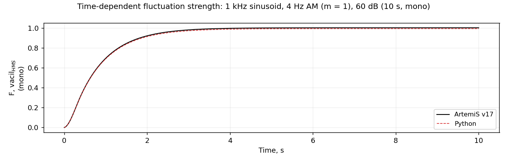

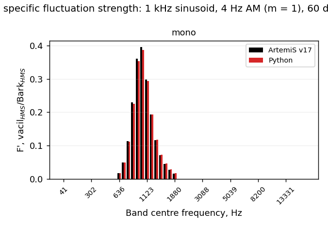

### 3.3 Two-component modulation

For the 4 Hz + 2 Hz envelope the Python result is 3.4 % above the reference. The excess is confined to two analysis blocks in which the coarse Stage-1 (Equation 144) estimate of the 2 Hz component happens to fall within the 4 % tolerance of Equation 154 and the order-2 harmonic complex is admitted, whereas the reference never does so on this signal. A bin-frequency Stage-1 estimator removes this but degrades agreement on both recordings, so the centroid estimator of Equation 144 is retained.

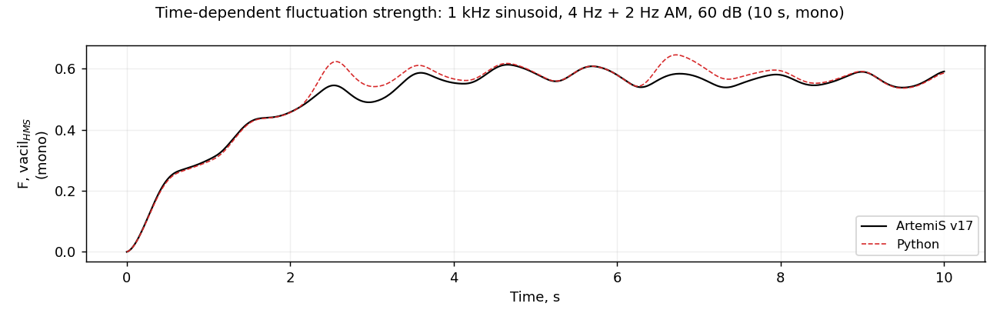

### 3.4 Recordings

On the three recordings the overall values agree with the reference to within -8 % to +12 %, and the time-dependent values are highly correlated (0.91 to 0.998). The time-band matrices show the same structure as the reference (see the busy street figure below). The residual pattern is systematic: bands carrying the dominant fluctuation strength run 5 to 10 % below the reference while weak (mostly high-frequency) bands run 10 to 35 % above, and the drone flyover peaks in the Park recording are overestimated by 10 to 15 % (2 to 3 kHz bands). This pattern is shared with the MATLAB implementation and reflects the remaining interpretational uncertainty in Sections 9.1.5 to 9.1.8 of the standard rather than the translation.

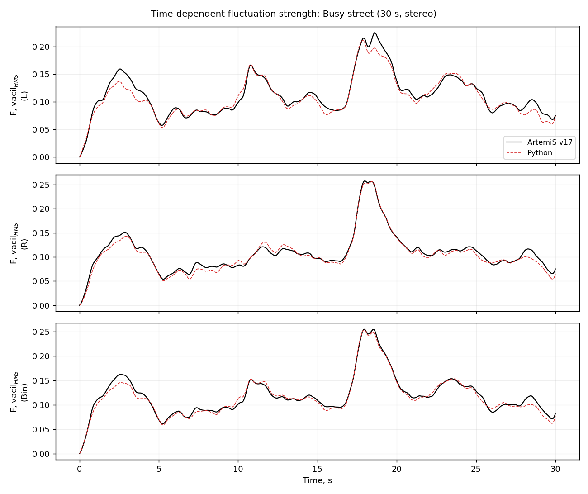

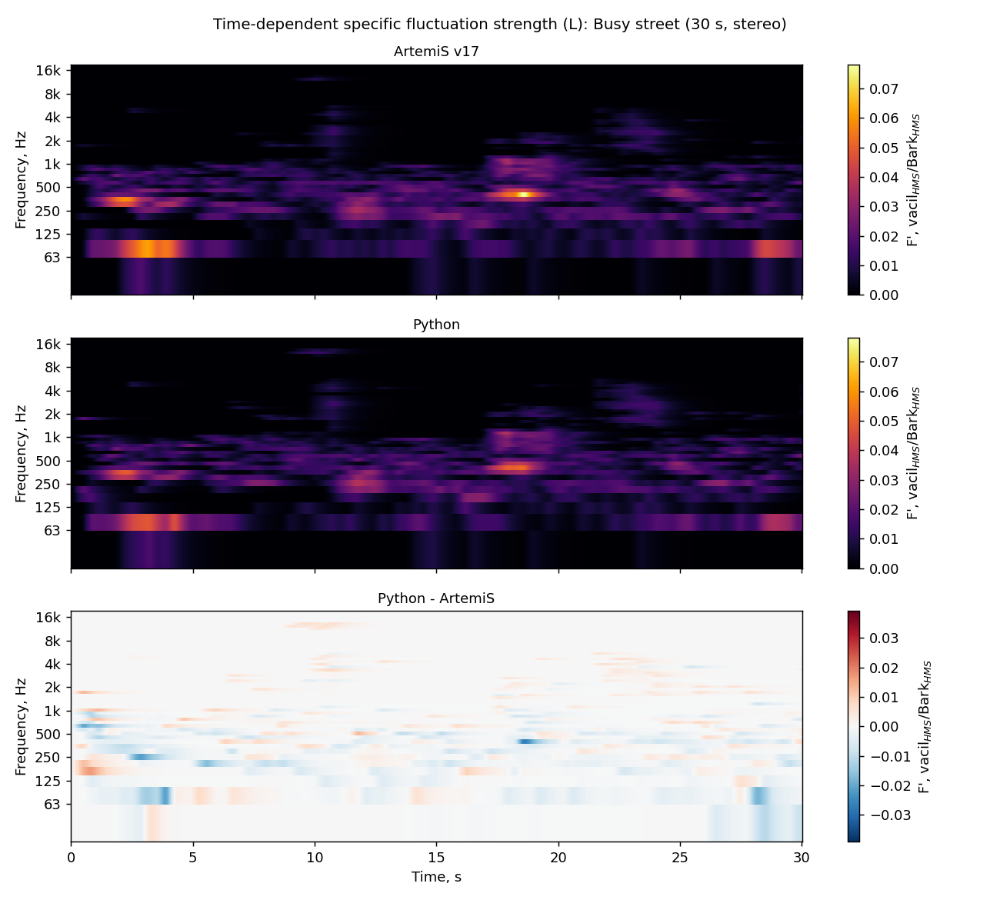

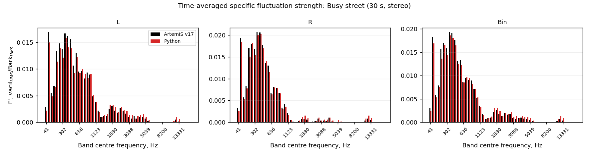

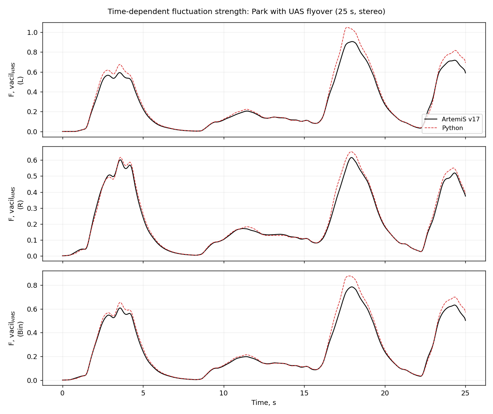

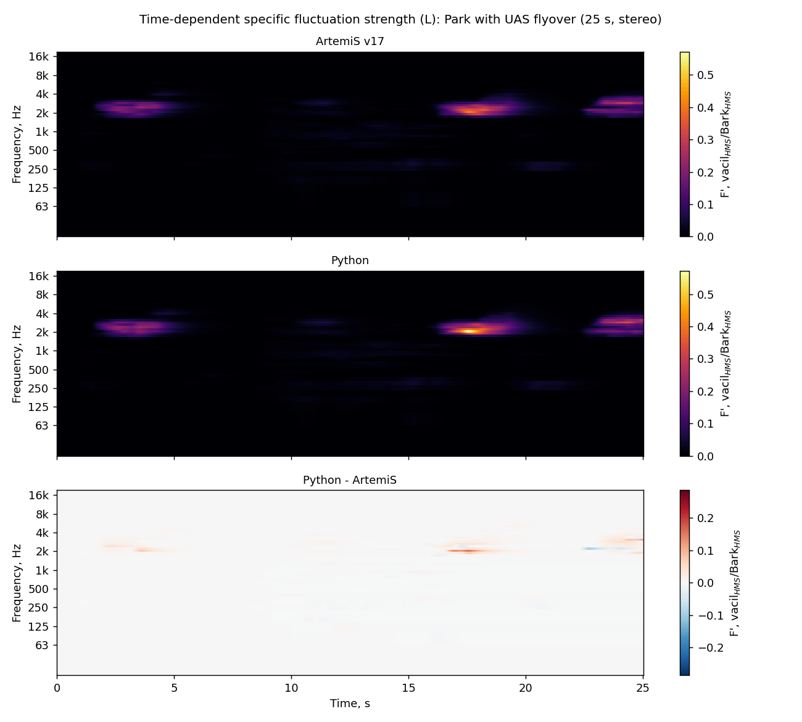

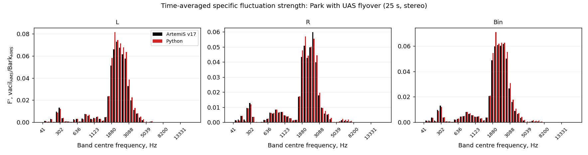

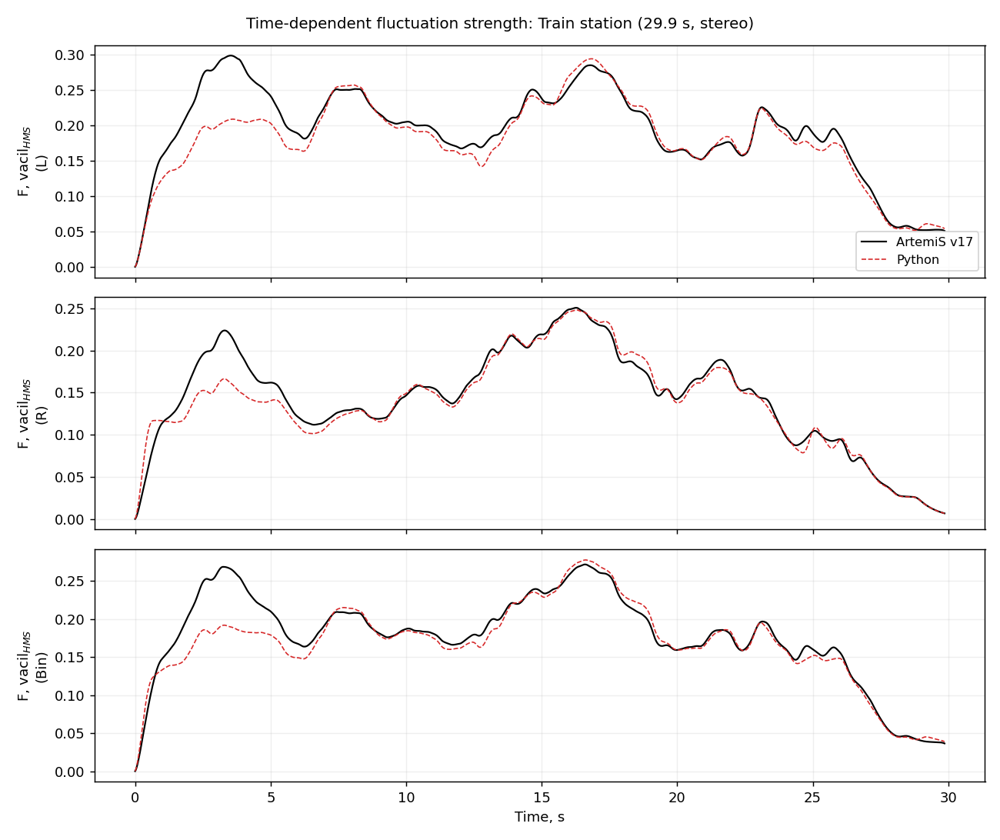

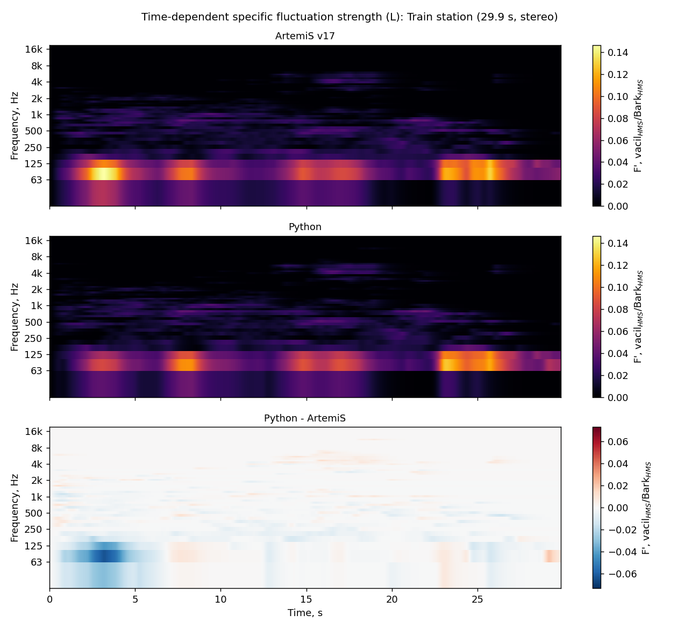

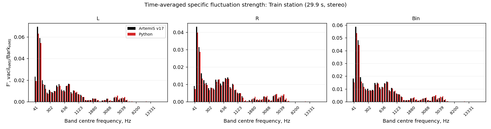

## 4. Departures from the printed standard

The implementation follows the MATLAB code, which departs from the printed text of ECMA-418-2:2025 in the following places. Each is documented at the point of use in the code, with the as-printed form retained in a comment.

1. **Equation 127 phase term** (`shm_hsa_window_response`): exp(-j*pi*f_n(k)*(...)) is used in place of the printed exp(-j*2*pi*f_n(k)*(...)). Confirmed by closed-form derivation of the window DFT and by numerical comparison with a direct DFT (the unit test `test_shm_hsa_window_response` checks this to 1e-6 relative).
2. **Equation 123 amplitude convention** (`shm_hsa`): the recovered spectral line amplitudes are two-sided line amplitudes (half the cosine amplitude), which is the convention required by Equations 159-160 and footnote 46; the literal inversion of Equation 123 gives one-sided amplitudes and overestimates fluctuation strength by a modulation-depth-dependent factor of 1.8 to 3.
3. **Equation 144** (`shm_hsa_block`): the printed "- 1" offset in the centroid estimator is omitted, since it biases every Stage-1 candidate by one DFT bin (0.73 Hz).
4. **Equation 152 step cap** (`shm_hsa_block`): 2e-1 Hz in place of the printed 2e-4 Hz, which with the 1/4 damping and 40-iteration limit would restrict the fine tuning to a total travel of 0.002 Hz.
5. **Section 9.1.8 interpretation** (`shm_hsa_block`): a harmonic complex of assumed order 2 or 3 is only accepted if one of the detected components lies at its fundamental (ratio 1 within 4 %).

One further point concerns a convention rather than the standard's equations:

- **90th percentile**: the package uses NumPy's default (linear, Hyndman-Fan type 7) percentile for consistency with the roughness function, whereas MATLAB `prctile` uses type 5. On the test signals the two definitions differ by at most 0.0005 vacil_HMS (Park, left channel: 0.7709 versus 0.7714); the MATLAB values in Section 2 were computed with the type 5 definition.

### 4.1 Implementation bug found and fixed (18 September 2026)

A genuine coding bug - not a departure from the standard - was present in `shm_env_window` (and, identically, in `acousticSHMFluctuation.m`) up to 18 September 2026: the end index of each interior quieter period (Section 9.1.3.4) was identified one sample early, because a `- 1` offset was applied to `np.diff(quiet_periods_pad[1:])` (MATLAB: `diff(quietPeriodsPad(2:end), 1)`) on the reasoning that the -1 -> 0 transition occurs one index after the last quiet sample. That reasoning is correct for an *unshifted* difference, `np.diff(quiet_periods_pad)`, but `quiet_periods_pad[1:]` is already shifted one index earlier, so the transition this difference detects already lands exactly on the last quiet index; the extra `- 1` therefore made each quieter-period length one sample short and could shift the updated window start by one sample. Confirmed with a minimal synthetic quiet run (`[1, 1, 0]` -> correct end index 1, length 2; the buggy code gave end index 0, length 1) and fixed by removing the offset, in both the MATLAB (`acousticSHMFluctuation.m`, commit `bfe8301`) and Python implementations on the same day. As quantified in Section 5, the fix's effect on the reported results is far smaller than the residual errors already documented in Sections 2 and 3, which are dominated by other causes; the tables and figures in this report reflect the fixed code.

## 5. Additional checks

- **Unit tests** (`tests/test_shm_fluctuation.py`): 21 tests covering the calibration signal at 48 kHz and 44.1 kHz (overall, specific, time-dependent and binaural outputs against the reference values), serial/parallel consistency, the input-length check, and the subfunctions (window response against a direct DFT, single- and multi-line HSA recovery to 1e-6, the band-pass weighting, the loudness nonlinearity and the moving median against direct evaluation). All 21 tests pass, as do the 11 existing tests for the other metrics (32 in total, 110 s).
- **Quieter-period end-index fix**: before the fix was applied, correcting the end index of each interior quieter period (removing the `- 1`) had no effect on the two sinusoids (no interior quieter periods occur), and changed the recordings negligibly relative to the residual errors already present: relative Frobenius error 1.1e-5 (Park) and 1.8e-4 (BusyStreet) in F'(l50, z), with the overall values changing by at most 2e-6 vacil_HMS. The fix was subsequently applied to both implementations (Section 4.1); re-running the full comparison against MATLAB and the reference afterwards reproduced the tables and figures in Sections 2 and 3 to the displayed precision, confirming the bug's effect was negligible relative to the other, already-documented residual sources.
- **TrainStation left channel intermediates**: of the 4238 non-quiet block/band combinations of the left channel, 13 differ between Python and MATLAB by more than 1e-6 in A(l,z) (median relative difference over all blocks 3e-9). Eleven of these differ by less than 1e-4 relative, in blocks where the Equation 152 fine tuning reaches the 40-iteration limit without converging (so that the final digits of the rate depend on the last digits of the error function); the remaining two (block 1, band 38, where the Section 9.1.3.3 window start differs by one sample because a smoothed envelope value lies on the rounded 1 % quieter-period threshold; and block 32, band 18, where the fine tuning converges to rates differing by 0.02 Hz) differ by 0.6 % and 6.3 % respectively. The effect on the final output is a relative Frobenius error of 1.9e-4 (Section 2).

## 6. Computation time

Measured on a 16-core desktop (Python 3.11, NumPy 2.3, SciPy 1.16), with no other load:

| Signal | `parallel_cores=1` | `parallel_cores=4` | `parallel_cores=None` (15 threads) |
|---|---|---|---|
| `sine_1kHz_4Hz_60dB` (10 s mono) | 7.6 s | - | 6.6 s |
| `BusyStreet1_0530-0600` (30 s stereo) | 165 s | 126 s | 219 s |

The run time is dominated by the HSA stage (Sections 9.1.4 to 9.1.10), which solves of the order of 100 small linear systems per block and band in a Python loop. Because these operations are too small to release the interpreter lock for a useful fraction of the time, the thread pool used for consistency with the other metrics gives only a modest speed-up on this stage with a few threads (about 25 % with four) and becomes slower than serial execution when many threads compete for the lock; `parallel_cores=4` is currently the fastest setting for long recordings, and the default (all but one core) is not recommended on machines with many cores. The MATLAB implementation takes 7 s and 72 s for the same two signals. A process-based pool, or vectorising the 16-candidate error-function evaluation of Section 9.1.5 across blocks, would be the natural next optimisation.

## 7. Conclusions

- The Python implementation reproduces the MATLAB implementation to floating-point precision on the synthetic signals, and on the recordings apart from isolated blocks where the standard's threshold and iteration-limit decisions fall on a numerical knife edge (worst case 0.3 % relative Frobenius error in one channel).
- Against the reference (ArtemiS v17), the overall fluctuation strength of the calibration signal is within 1 %, the two-component signal within 4 %, and the recordings within -8 % to +12 %, with time-dependent correlations of 0.91 to 0.998.
- The remaining discrepancy on complex recordings (dominant bands slightly low, weak bands high, drone flyover peaks high) is inherited from the MATLAB implementation and is the priority for further work on the interpretation of Sections 9.1.5 to 9.1.8.
